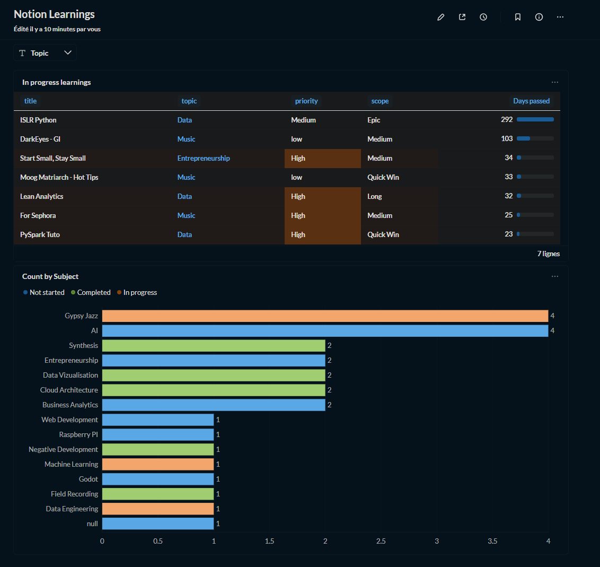

# Logique Analytique Metabase 📈



Ce dossier contient les requêtes SQL utilisées pour générer les indicateurs de performance (KPIs) du dashboard.

## 1. Suivi du temps de progression (Days Stuck)
Cette requête permet d'identifier les sujets d'apprentissage qui stagnent en calculant le nombre de jours écoulés depuis le début du cours.

```sql
SELECT
  title,
  topic,
  priority,
  scope,
  julianday(current_date) - julianday(date_started) as days_stuck
FROM learnings
WHERE status = 'In progress' [[AND {{topic}}]]
ORDER BY days_stuck DESC
```

- Utilité technique : Utilisation de julianday pour effectuer de l'arithmétique de dates sur SQLite.

- Valeur métier : Alerte visuelle sur les cours "bloqués" depuis trop longtemps (ex: ISLR Python à 292 jours).

## 2. Répartition par Sujet et Statut
Cette requête alimente le graphique à barres principal pour visualiser la charge d'apprentissage globale.

```sql
SELECT 
  COUNT(*), 
  subject, 
  status 
FROM learnings 
[[WHERE {{topic}}]] 
GROUP BY subject, status 
ORDER BY COUNT(*) DESC
```

- Fonctionnalité Metabase : Intégration de variables de filtrage dynamiques {{topic}} pour permettre à l'utilisateur de filtrer le dashboard par catégorie (Data, Music, Entrepreneurship).

